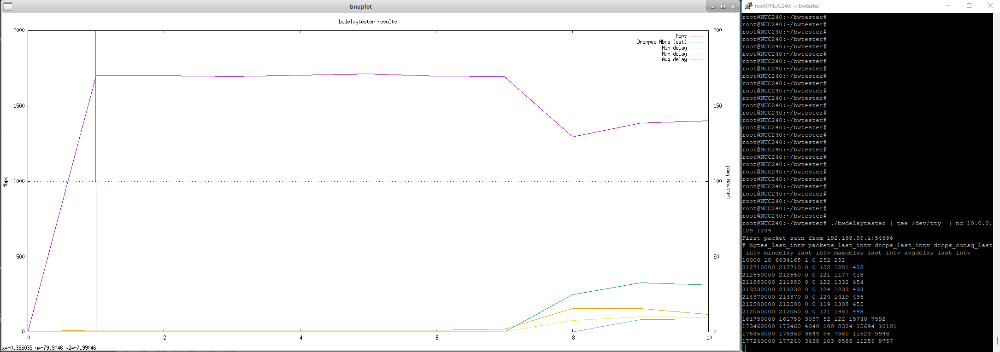
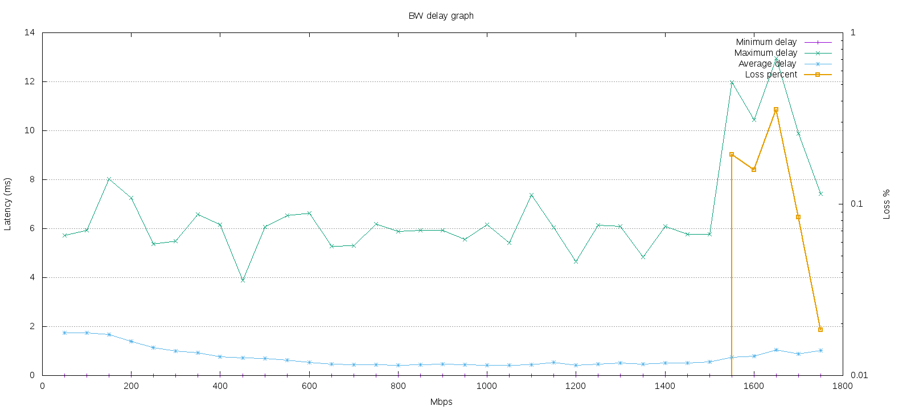
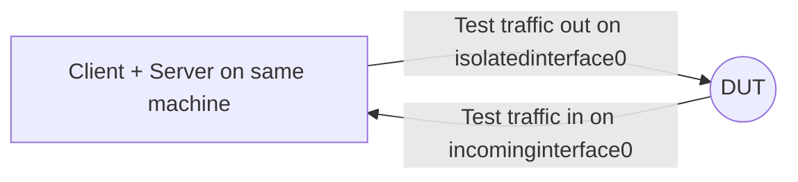
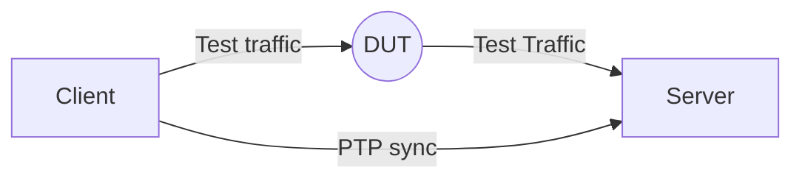

# Bandwidth Delay Tester

bwdelaytester is a simple linux program (< 1k lines of code), to:
- Send UDP packets from a sender to a receiver, at a target speed
- Measure the received bandwidth and latency of the packets at the receiver

Think of it as a very simple "iperf", but with the explicit design of measuring latency as well

## Usage

This is the usage that is also printed in the application

```
Bandwith-delay tester.

 Send IPv4 UDP packets containing timestamping information from sender to receiver, to determine received bandwidth and latency

        Client Usage: ./bwdelaytester -c <dstip> -p <packet size> [-d <interpacket_delay_ns> | -b <bandwidth_mbps>] [-s (sweepmode)] [-n (nonblocking mode)] [-i sourceinterfacebind] [-l <compensationlatencyms] [-a (async)]
        Server Usage: ./bwdelaytester  [-i sourceinterfacebind] [-s (sweepmode)] [-l <compensationlatencyms] [-a (async)]


         -The targetbandwidth can be supplied either with -d or -b

         -Async mode is only needed if sender and receiver clocks (CLOCK_REALTIME) are not synced (ideally < 0.1ms), e.g. through PTP
                 In this mode, the absolute latency measurement will only be an estimate, and can be furthered tuned with -l

         -Sweep mode at the client allows it to sweep the bandwidth from 0Mbps till the filled in amount.
         -Sweep mode at the server will, upon exit, print some statistics per speed range (for histogram usage).

         -Optionally the target interface can be bound to using -i
         -Optionally the sender socket can be placed in non-blocking mode. (not necessairly useful)

         -The UDP port is hardcoded to 8888

         Example client and server to send 1kB packets from 192.168.1.2 to 192.168.1.1, devices being time synced:

                 CLIENT:  ./bwdelaytester -c 192.168.1.1 -p 1000 -b 1000
                 SERVER:  ./bwdelaytester


```

## Comping

On linux, simply use gcc:

```
root@PC:~/# gcc bwdelaytester.c -o bwdelaytester
```

## Example output

```
# On client:
root@client:~/# ./bwdelaytester -c 192.168.99.2 -b 1700 -p 1000

# On server:
root@server:~/# ./bwdelaytester
First packet seen from 192.168.99.1:39484
# bytes_last_intv packets_last_intv drops_last_intv drops_consq_last_intv mindelayus_last_intv maxdelayus_last_intv avgdelayus_last_intv
10000 10 0 0 0 1628 1628
193770000 193770 656 47 448 11203 5345
169470000 169470 3492 13 5074 13250 9164
146790000 146790 6682 22 5761 21465 11329
169600000 169600 3667 19 4819 15465 9364
191110000 191110 3786 18 5382 15313 8443
224810000 224810 0 0 124 6683 2708
214170000 214170 0 0 123 1196 426
212300000 212300 0 0 125 1213 433
212430000 212430 0 0 123 1162 414
212110000 212110 0 0 125 1098 402
213220000 213220 0 0 126 1771 453
212680000 212680 0 0 122 1369 479
212680000 212680 0 0 128 1193 420
```

## Live graphing with gnuplot

The data outputted can be plotted after the test, or in realtime using the gnuplot scripts from [`liveplot.gnuplot`](plotting/liveplot.gnuplot).

Using simple linux piping and netcat, one can transmit the output data to another PC:

```
root@plotter:~/plotting/# # Plotter is reachable from server at 10.0.0.129 - ideally on a connection not impacted by the load test

root@plotter:~/plotting/# while true; do nc -l -p 1234 > data.dat < /dev/null; sleep 1; done &
root@plotter:~/plotting/# gnuplot liveplot.gnuplot
```

```
root@server:~/# # Run the tester, but output everything to the terminal, as well as send it with netcat to the plotter

root@server:~/# ./bwdelaytester | tee /dev/tty  | nc 10.0.0.129 1234
```

The gnuplot script will continuously poll for new updates in the file data.dat, and update its output accordingly:



Press control+x to stop gnuplot from plotting, P to zoom back to the previous preset

## Bandwidth-delay sweep plot

When sweeping the bandwidth range from 0 till the supplied max with the -s option on both client and server, the bandwidth is gradually increased over time.
It is possible to still follow this output in time as explained above.
But when exiting the server, it will print and extra chunk of data, to STDERR, which contains the bandwidth slot, and its corresponding losspercent, minimum maximum, average delay and amount of times the measuring interval fell inside this slot.

``` 
163070000 163070 0 0 75 1027 207
164310000 164310 0 0 74 1048 201
163600000 163600 0 0 74 966 206
163770000 163770 0 0 74 1267 217
162930000 162930 0 0 75 1034 211
^C70 0.000000 0 3594 154 14    <====== Point of control+c on server side
90 0.000000 0 3687 176 19
110 0.000000 0 3307 156 19
120 0.000000 0 3723 163 18
140 0.000000 0 4820 155 20
160 0.000000 0 4195 161 20
...
```

One can copy-paste the STDERR output again to a plotfile (bwdelaydat.txt), and run gnuplot again on it [`bwdelay.plot`](plotting/bwdelay.plot). This could yield something like:



Note how the minimum latency can go down with increasing traffic, due to cache-effects and reduced context switching. Not also that at a certain point the link might get (temporarly) saturated, causing loss and higher maximum delays. 

## Syncing client and server

One can route traffic back to the same host, in which case async mode is never required. The server and client are implicitly synced. Note that the use of VRF's might be required to avoid the device directly sending to itself instead of to the outgoing interface
Some example VRF code, in which case one interface (isolatedinterface0) is placed in a VRF, and thus cannot see the incoming interface directly in its routing table:

```
ip link add dev vrf1 type vrf table 10
ip l set dev isolatedinterface0 master vrf1
ip r add default via 192.168.88.1 vrf vrf1
ip l set dev vrf1 up
ip a add dev isolatedinterface0 192.168.88.2/24 
ip a add dev incominginterface0 192.168.88.1/24 
```



In case two different systems are used, one can use PTP for example to sync the CLOCK_REALTIME.
Timestamp delays are reported in microseconds. If the two systems are not submicrosecond synced, this will not be correct. 
(HW-Timestamping with PTP achieves submicrosecond clock sync)




## Taking into account Linux backpressure

In a setup like this: 


When the interface out is saturated, it is possible that linux prevents the userspace application from sending more data than the link can handle.
In the blocking case, when e.g. 3Gbps is requested, and the outgoing interface link can only do 2Gbps, it is possible the bwdelaytester application is suspended by the kernel in the sendto system call such that it only generates 2Gbps, and no drops are seen.

To avoid this backpressure, there are two options:
- Generate the traffic on yet another machine, and put the Client machine in routing mode:


- Or, keep the setup with just two devices, but apply a different queueing discipline:

```
tc qdisc replace dev slowintfdev0 root netem delay 10us limit 5
```

This enforces linux to queue the packets, and decouple the sender thread from the interface dequeueing driver.
Tuning the buffer size of the netem qdisc (now at limit 5) allows trading off bursty traffic (which generally achieves higher throughput) at the expense of latency jitter.

